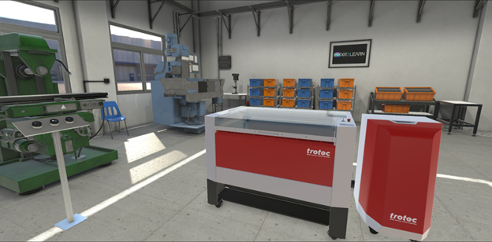
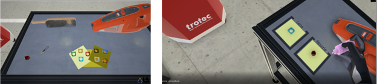
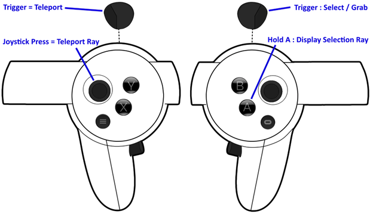
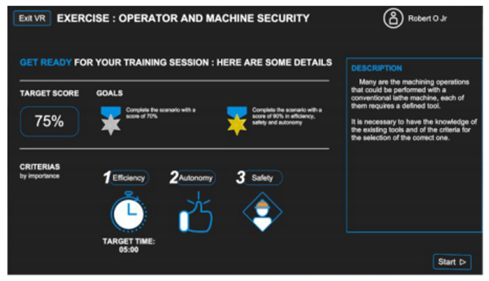
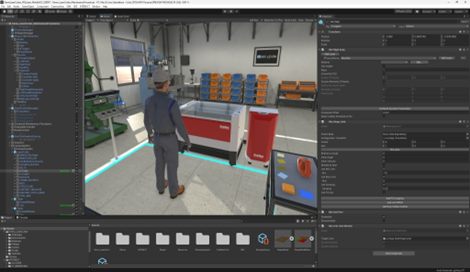

# Beacon Application "Laser Cutting Machine"

**Target audience**: Educators / Instructional Designers / Software developers / XR enthusiastic

## Introduction
The Beacon Application "Laser Cutting Machine" is a sandbox application that demonstrates the creation of a virtual reality training scenario (maintenance tasks of a machine) through the use of the Enabler "INTERACT". With the application, the user is taught how to clean an industrial laser cutting machine in a step by step process and also validated with a score in the end. The application also illustrates the numerous possibilities such as creating interaction with objects, ease of configuring a scenario, visual effects to the machine etc 

## Prerequisites
Executable: the built application requires a VR-Ready PC on Windows with SteamVR installed, up-to-date drivers, and a PC VR headset.
Unity Project: this Beacon Application project requires Unity the 3D engine, and the Enabler "INTERACT" as a plugin to Unity.

### HARDWARE Prerequisites
A fairly recent VR-ready laptop or desktop computer running Windows 10/11
A Meta Quest 2 VR headset and its Touch controllers
(if any other SteamVR compatible headset is used, please disregard each step about Oculus / Meta specific installations)
An Oculus Link cable (or any compatible USB-C cable with enough bandwidth).

### SOFTWARE Prerequisites
Install SteamVR. An offline version (which doesn’t require a Steam account) is proposed.
For Meta headsets: install the Oculus Application, and connect with your Oculus / Meta account. The same account should be used on the computer AND on the VR headset.
ROOM SPACE : if possible have a free space of 4x4 m². Less is possible, but less comfortable.

## Steps

1. Setup VR Environment

- Launch the Oculus/Meta PC app and sign in (if using a Meta headset). 
- Connect your headset via Link or compatible USB-C cable. 
- Start Quest Link / Rift from within the headset quick settings. 

2. Launch the Application

- Unzip DemoLaserCutter_XR2Learn.zip on your PC. 
- Run the executable: "Demo XR2Learn Laser.exe".

3. Enter VR and Train

- Put on the VR headset. 
- Use the motion controllers to interact with the virtual laser cutting machine. 
- Follow the step-by-step instructions shown in the VR environment. 

## Expected Output

When set up and launched correctly:

✔ You should see a virtual room with a laser cutting machine. 

✔ Your VR controllers should map to virtual hands in the environment. 

✔ The application will guide you through the maintenance workflow with interactive objects. 

✔ After completing steps, you’ll receive a score based on accuracy and use of assist features. 

## Unity project
This Beacon App has been built using Enabler 1: INTERACT. It is a typical example of how INTERACT can be used as a framework to create step-by-step immersive learning procedures from industrial 3D CAD data. 
The resulting Unity project has been delivered in the XR2Learn public repository. The community can therefore analyze the project structure and use it as a sandbox for learning how to produce similar use cases. In particular, XR authors opening Beacon application 1 project can :
- Import new 3D models (native CAD file or 3D scan)
- Define Interactable components. An interactable component is an object requiring physical interaction in order to be manipulated and assembled in the scenario 
- Configure part to be assembled (kinematics and dynamic behavior)
- Define part targets (keypoint) in the final assembly. These keypoints will also serve as helpers for the worker (displaying a ghost of the part destination)
- Create a step by step scenario corresponding to the work sequence by configuring the order of keypoints. The scenario acts as a state machine defining when assembly steps should be activated/deactivated
- Import extra media to provide further information on the training (pdf, images, videos, audio files)
- Set up assistance and feedback

The Unity project is organised into a structured hierarchy for easy exploration, modification, and facilitates onboarding. In the Asset section, separated folders contain scripts, 3D assets, textures, scenes, and prefabs.
When opening the source project,  a particular attention should be given to the scene structure where physical objects (that can be interacted with) are materialised with a gear icon. Different physical behaviours are illustrated from free moving objects to constrained parts (ex : laser machine top lib with a revolute joint). Intrinsic part properties (mass, center of gravity, friction) are also displayed to fine tune object interaction and reach physical accuracy.

## Troubleshooting
❗ VR Headset Not Connecting

- Confirm headset drivers and Oculus/SteamVR are fully updated. 
- Reboot the PC and reconnect USB-C link. 

❗ No VR Image / Black Screen

- Ensure SteamVR is running before launching the app. 
- Check that the correct VR runtime (Oculus or SteamVR) is active. 

❗ Controllers Not Tracked

- Make sure tracking cameras/sensors are positioned correctly. 
- Restart the VR input system in SteamVR settings. 

❗ Low Performance / Lag

- Close background applications. 
- Try reducing render quality or upgrading GPU drivers. 

## Licence 
Please see the [LICENSE](Assets/INTERACT/00_CORE/Editor/Assembly/xNode/LICENSE.md) file for more details.
